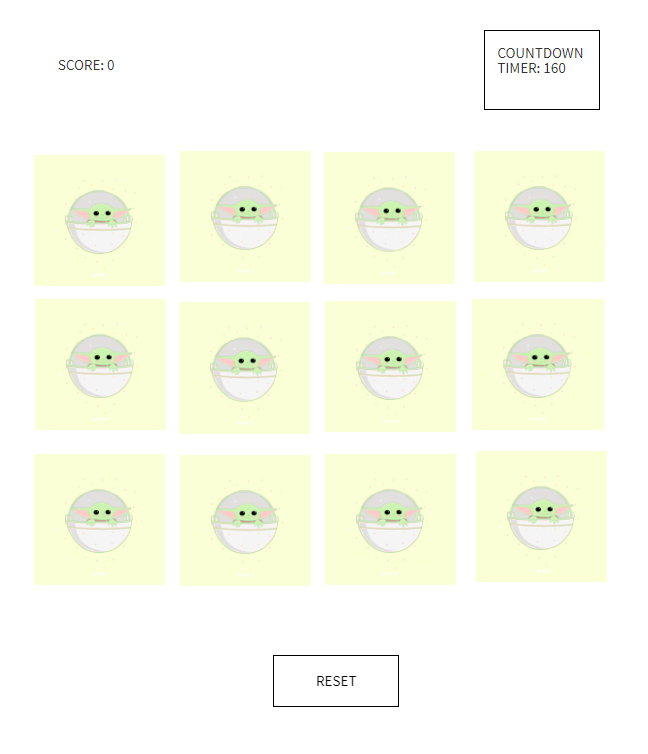
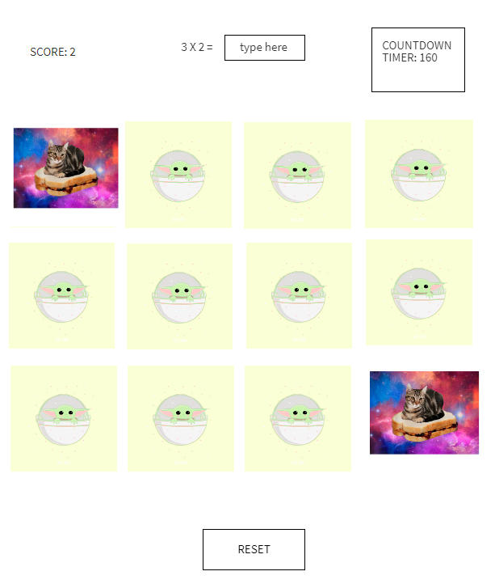
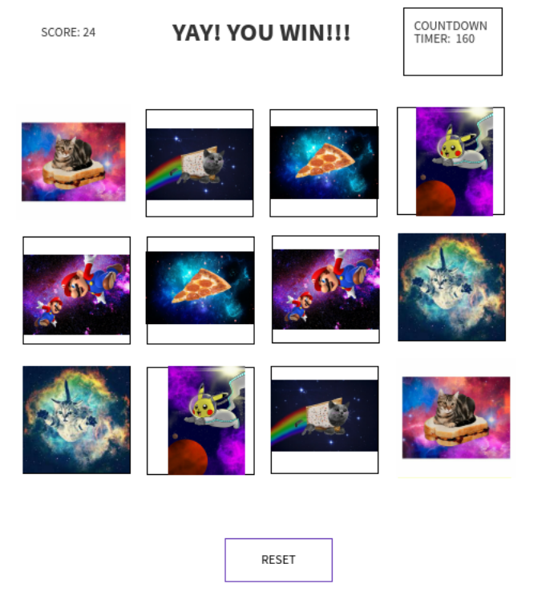

# 🃏Matching Card Game - General Assembly - SEI Project 1

Matching card game is a browser based version with a mulitplication twist. This browser based game was created for General Assembly's Software Engineering Immersive (SEI) Program.

## 💡Inspiration for the game
As a former math teacher, I wanted to build an engaging and purposeful game to inspire students to practice their multiplication facts while having fun. 

## 💻Technologies Used
The matching card game uses HTML, CSS and Javascript.

## Getting Started
To play, access the browser based game here: 
(https://angelamchoi.github.io/card-game/)

Match the correct cards before the time runs out. When there is a correct match, the user will solve a multiplication problem and will receive extra points. Enjoy your daily dose of math :)

Good luck!

## Next Steps 
The follow are the next steps in improving the matching card game:

- Allow players to save their progress when they return back to their game
- Include different levels such as medium and difficult
- Make it mobile responsive
	
## Development Process
To provide insight of how the browser based game was developed, this section will cover the following topics:

1. Project Requirements
2. Wireframe
3. Psuedocode
4. Reflection / Difficulties Faced
5. Content of the Working Version

### 1. Project Requirements
The objective of the project was to incorporate the fundamentals of HTML, CSS, and JavaScript and create a browser based game which included the following technical requirements:

- Render a game in the browser.
- Include win/loss logic and render win/loss messages in HTML. 
- Include separate HTML, CSS & JavaScript files.
- Have properly indented HTML, CSS & JavaScript. In addition, vertical whitespace needs to be consistent.
- No remaining dead and/or commented out code (code that will never be called) .
- Functions and variables that are named sensibly. 
- Be coded in a consistent manner. 
- Deploy your game online using GitHub Pages 

### 2. Wireframe
Before diving into coding the game, I created a mockup for the browser based game. I used [MockFlow](https://mockflow.com/apps/wireframepro/) to help me visualize the end goal of the game. 
 

### 3. Pseudocode
After creating a mockup, I began to pseudocode. The following is pseudocode that was written before building the game. Pseudocode allowed me to think through each step of building my game and think deeply how on how the user will be interacting with the game. It also reminded me of lesson planning when I was a teacher and thinking through from introducing to lesson to incorporating independent practice time for students. I followed this template to aid me in structuring an organized process.

**Data Structure**
- Card images  
	- create an array of images
	- when you click image url path shows
- placeholder (baby yoda)
- data structure
	- player choice
	- when click push an object and then clear
	- matched! 
		- update match property to true that way the card will always be flipped

**Start Game/Reset Game**
- display timer
- display score = 0
- display cards (not flipped)
- when a user clicks on a card --> flip card for 2 seconds and then unflip
- when user clicks on 2 cards and they are the same
	- **correct** = go through each card and if match is correct then display multiplication problem && update score (increment by 1) && display picture
	- **wrong**= then display message try again and score stays the same

**Math Problems**
- when a user gets gets a matching set then display multiplication problem
- user can press enter || click enter to submit answer
- after user submits correct answer then question disappears 
	- submit button
- if answer is correct then update score 
- use math.random to generate random multiplication problem

**End Game**
- if user doesn't have any matches game over && display 'try again'
- if user finds all the matches then user wins && display winningMessage
- clear user choices' array and the length is 2

**Reset Game**
- when reset button is click then 
	- cards are blank
	- shuffle cards into different location and display blank cards
	- score is = 0
	-  display timer (timer begins)

**Extras**
1. timer (countdown timer)
2. score
3. mobile responsive design

### 4. Reflection / Diffculties Faced
Overall, I thoroughly enjoyed building my game. 

Reflection
- `Console.log` is my new BFF
	- I have used `console.log` to help me debug and find errors. It is truly an amazing best friend who will have your back to help you find your mistake :)
- Continuous journey of learning JavaScript
	- JavaScript is incredibly powerful. While I was building my game I felt like I learned new things about JavaScript and its capabilities. I hope to continue to deepen my knowledge in JavaScript to unlock 
- Math + Coding = So Fun!!
	- I love that I was able to combine my prior work experience (math teacher) with coding by sneaking in math problems in the game 😊
- Various solutions 
	- I love that there are variety of solutions to solving a coding problem. There are efficient and clean ways of writing code. Building my game has taught me to find a solution that works best for me and that I can understand. I will continue to work towards crafting a cleaner and more efficient code.

Difficulties faced
- Positioning Random Pictures
	- This part was challenging for me.
	- I used Fisher Yates Algorithm to help me randomly position my cards. Although it was challenging. I love this algorithm!
- Start small and then scale up
	- I learned that I need to start small with 4 cards and make it work.

### 5. Contents of the Working Version
The working version of the card matching game consists of the following:

index.html - The main page that users will interact with
style.css - The style for the main page
main.js - The code for the matching card game
/pics - Folder containing the images used in the game