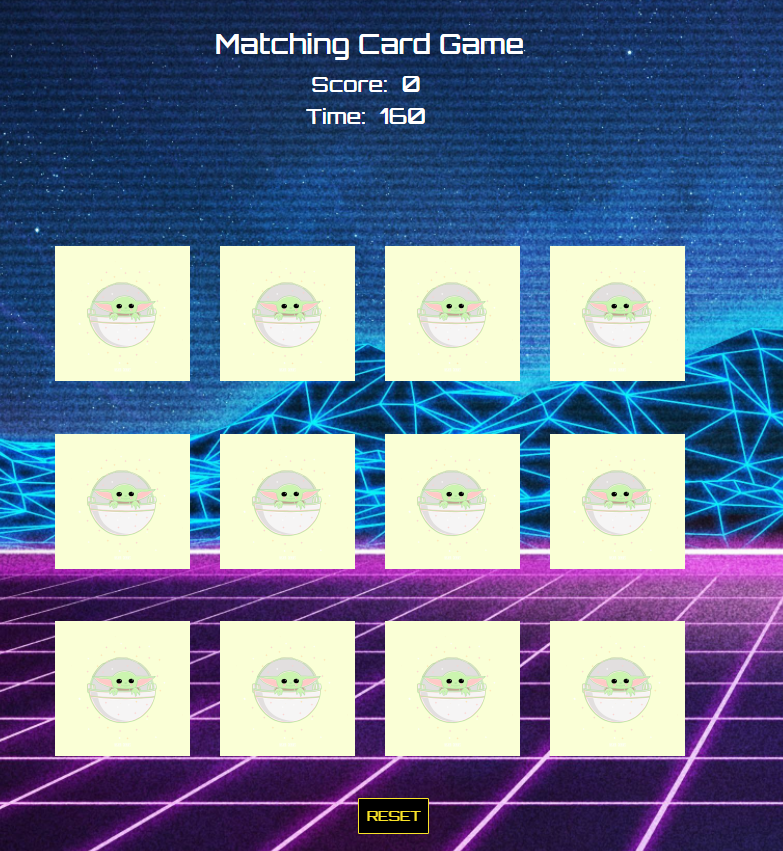
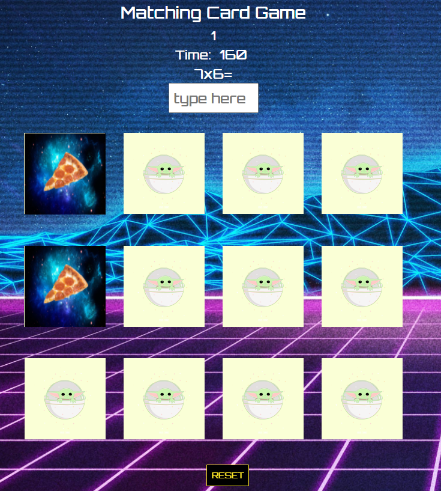

# 🃏Matching Card Game - General Assembly - SEI Project 1

Matching card game is a browser based game with a multiplication twist. This browser based game was created for General Assembly's Software Engineering Immersive (SEI) Program.

## 💡Inspiration for the game
As a former math teacher, I wanted to build an engaging and purposeful game to inspire students to practice their multiplication facts while having fun. 

## 🎮Getting Started
To play, access the browser based game here: 
(https://angelamchoi.github.io/card-game/)

Match the same cards. When there is a correct match, the user will solve a multiplication problem and will receive extra points. Enjoy your daily dose of math😀

Good luck!

## 💻Technologies Used
The matching card game uses HTML, CSS and Javascript.

## 📓Next Steps 
The follow are the next steps in improving the matching card game:

- Allow players to save their progress when they return back to their game
- Include different levels such as medium and difficult
- Make it mobile responsive
- Include various math operations (add, sub, multi, divide) and allow users to choose which operation they want to play 
	
## 🛠️⚙️Development Process
The browser based game was developed, this section will cover the following topics:

1. Project Requirements
2. Wireframe
3. Psuedocode
4. Reflection / Difficulties Faced
5. Content of the Working Version

### 1. Project Requirements
The objective of the project was to incorporate the fundamentals of HTML, CSS, and JavaScript and create a browser based game which included the following technical requirements:

- Render a game in the browser.
- Include win/loss logic and render win/loss messages in HTML. 
- Include separate HTML, CSS & JavaScript files.
- Have properly indented HTML, CSS & JavaScript. In addition, vertical whitespace needs to be consistent.
- No remaining dead and/or commented out code (code that will never be called).
- Functions and variables that are named sensibly. 
- Be coded in a consistent manner. 
- Deploy your game online using GitHub Pages 

### 2. Wireframe
Before diving into coding the game, I created a mockup for the browser based game. I used [MockFlow](https://mockflow.com/apps/wireframepro/) to help me visualize the end goal of the game. 
 

	

When a user matches the same cards, the cards will stay facing upIf the match is correct, then a multiplication problem and an input to type the answer will appear. When the user finds all the matches then a winning message will appear. 

### 3. Pseudocode
After creating my mockup, I began to pseudocode. The following is pseudocode that was written before building the game. Pseudocode allowed me to think through each step of building my game and think deeply how on how the user will be interacting with the game. It also reminded me of lesson planning when I was a teacher and thinking through from introducing to lesson to incorporating independent practice time for students. I followed this template to aid me in structuring an organized process.

**Data Structure**
- Card images  
	- create an array of images
	- identify same card by image url path 
- Player choice

**Variables**
- time
- firstCardImg
- secondCardImg
- card count check
- correct pair of cards
- num 1 & num 2 (for multiplication game)
- answer 

**Event Handlers**
1) Reset button 
- When reset button is clicked, initalize the game.

2) Cards clicked
- For each card add a click event to flip card.

3) Inputting Answer
- When user types in the answer for the multiplication question and presses enter, add event listener event for keyboard event.

**Functions**
1) Shuffling Array
- Use Fisher-Yates shuffle Algorithm to iterate through cards array
- Create a new array for shuffled array
- Iterate each front card set the source attribute to the new array.

2️) Flip Event
- When a user clicks on a card only 2 cards can be flipped at a time.
- Disable from clicking on the same card twice (remove event listener)
- Go through each card and if match is: 
	- 👍Correct
		- Display multiplication problem 
		-Update score (increment by 1)
	- 👎Incorrect  
		- No multiplication problem
		- score stays the same

3) Check for Match
- Get firstCardImg source and secondCardImg source 
- If firstCardImg source matches secondCardImg source then go to `function correct()`
- If it firstCardImg source does not match secondCardImg then go to `function incorrect()`

4) Correct
- If match is correct
	- Front cards will stay facing up 
	- Update score board 
	- Display math problem
	- Go to flip event

5) Incorrect
- Cards will not stay facing up
- User can try again
- Go to flip event

6) Math Problems
- Generate 2 random numbers by using `Math.floor(Math.random()` and have them multiply each other
- Display math problem and input section for answer
- Use parseInt to convert it into an integer

7) Check Keyboard Event
- After user types the answer for the math question, then add event listener for enter key event

8) Check Answer
- If answer is correct then update score
- Math question and input section disappears
- If all 6 pairs of cards have been flipped then show winning message
- Display math question and input section for answer
-Use parseInt to convert into an integer

9) Card Reset
- When reset button is clicked, then loop through all cards and change their position to the original position
- When firstCardImg and/or secondCardImg are/is clicked then flip card
- Use event handler

10) Init
- Set matchedCards = false
- cardCheck = 0
- Shuffle cards into different positions
- Go to card reset
- score = 0
- firstCardImg and secondCardImg haven't been clicked
- Timer begins

**Extras**
1. Timer (countdown timer)
2. Score
3. Mobile responsive design

### 4. Reflection / Difficulties Faced
Overall, I thoroughly enjoyed building my game and learned a tremendous amount on JavaScript and building a browser based game. 

Reflection
- `Console.log` is my new BFF
	- I have used `console.log` to help me debug and find errors. It is truly an amazing best friend who will have your back to help you find your mistake :)
- Continuous journey of learning JavaScript
	- JavaScript is incredibly powerful. While I was building my game I felt like I learned new things about JavaScript. I hope to continue to deepen my knowledge in JavaScript to unlock its capabilities.
- Math + Coding = So Fun!!
	- I love that I was able to combine my prior work experience (math teacher) with coding by sneaking in math problems in the game 😊
- Various solutions 
	- I love that there are variety of solutions to solving a coding problem. There are efficient and clean ways of writing code. Building my game has taught me to find a solution that works best for me such as documentations and coding example references that I can understand. I will continue to work towards crafting a cleaner and more efficient code.

Difficulties Faced
The following are some challenges I encountered:

- Positioning Random Pictures
	- This part was challenging for me.
	- I used Fisher Yates Algorithm to help me randomly position my cards. Although it was challenging. I love this algorithm!
- Locating image source for the new array
- Start small and then scale up
	- I had a very ambitious goal of having 16 cards. I quickly learned that I need to start small with 4 cards and make everything work. Then, I can apply the same principles on a larger scale.

### 5. Contents of the Working Version
The working version of the card matching game consists of the following:

- index.html - The main page that users will interact with
style.css - The style for the main page
- main.js - The code for the matching card game
- /pics - Folder containing the images used in the game